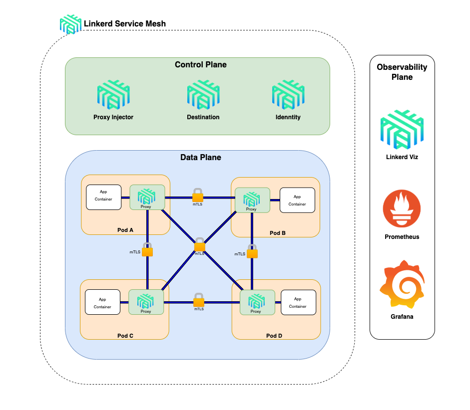
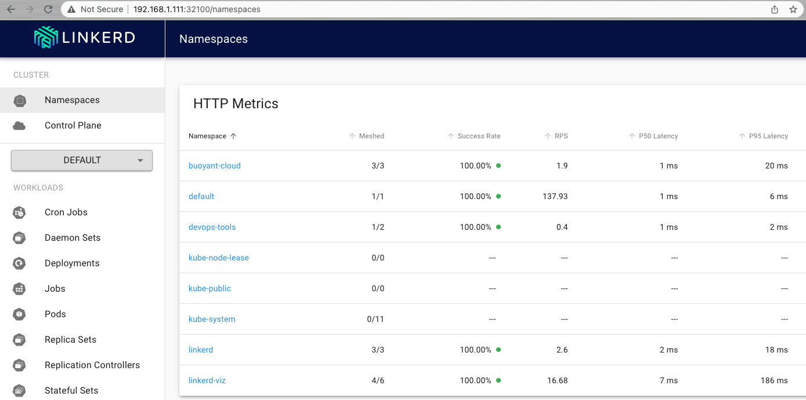
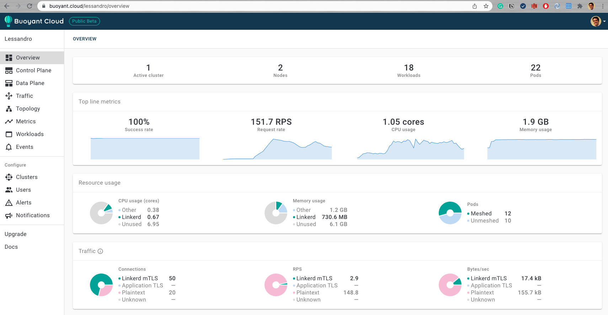

# Services: Linkerd

## Index

- [Summary](#summary)
- [Diagram](#diagram)
- [Proxy Injection](#proxy-injection)
- [Dashboard](#dashboard)
  - [Linkerd](#linkerd)
  - [Buoyant](#buoyant)

## Summary

This deployment will set up <a href=https://linkerd.io/2.10/overview/>Linkerd</a>.

_Linkerd is an open source service mesh designed to be deployed into a variety of container schedulers and frameworks such as Kubernetes._

## Diagram



## Proxy Injection

Linkerd automatically adds the data plane proxy to pods when the `linkerd.io/inject: enabled` annotation is present on a namespace or any workloads, such as deployments or pods. This is known as “proxy injection”.

**example:**

```yaml
apiVersion: apps/v1
kind: Deployment
metadata:
  labels:
    app: nginx
  name: nginx
spec:
  replicas: 1
  selector:
    matchLabels:
      app: nginx
  template:
    metadata:
      labels:
        app: nginx
      annotations:
        linkerd.io/inject: enabled #Annotation Automatic Proxy Injection
    spec:
      containers:
        - image: nginx
          name: nginx
          ports:
            - containerPort: 80
```

## Dashboard

### Linkerd

Once the Ansible role `roles/k8s/linkerd` is deployed, we can access the Linkerd dashboard through `http://192.168.1.111:32100`



### Buoyant

For the Buoyant dashboard I'd recommend you to install it manually as you need to set up an account based on the installation instructions, <a herf=https://linkerd.io/2.11/getting-started/#step-5-explore-linkerd>link</a>.


